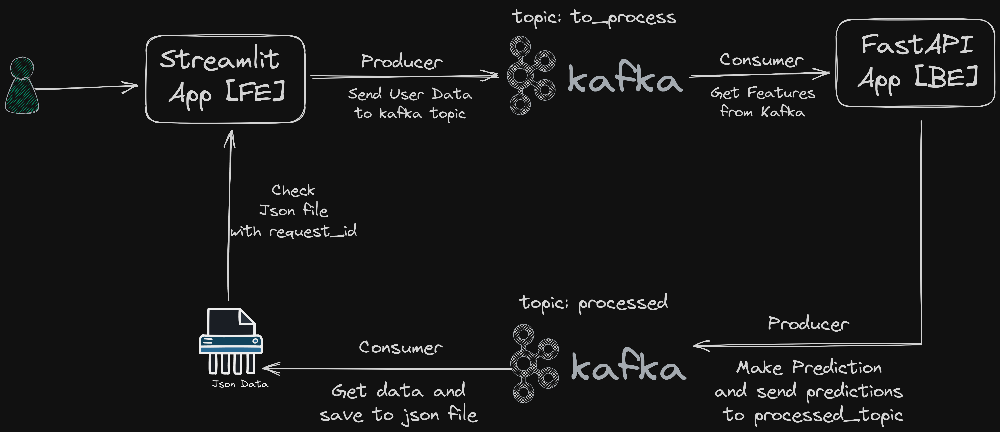
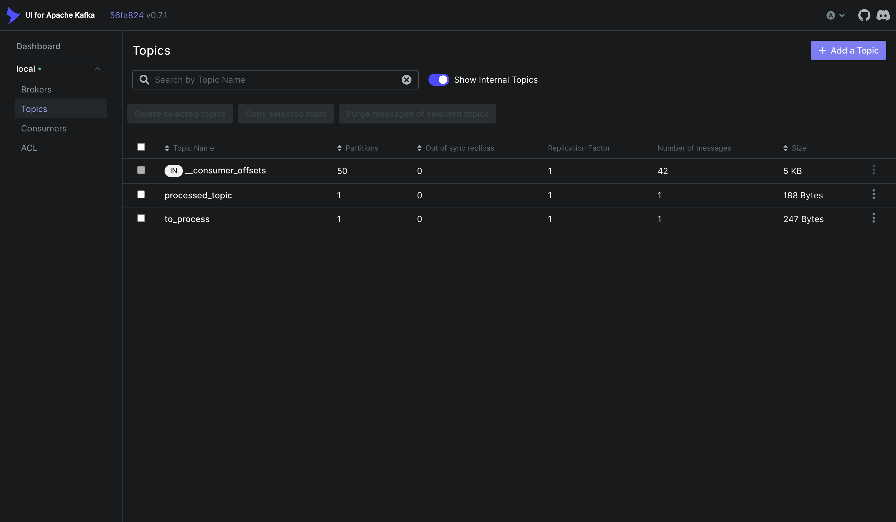
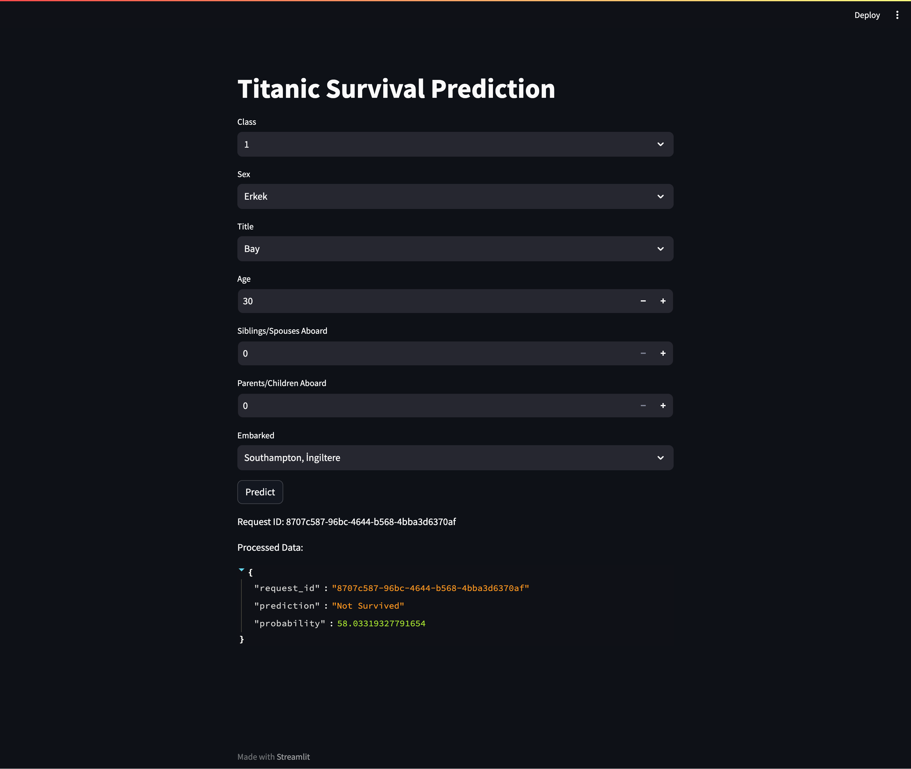
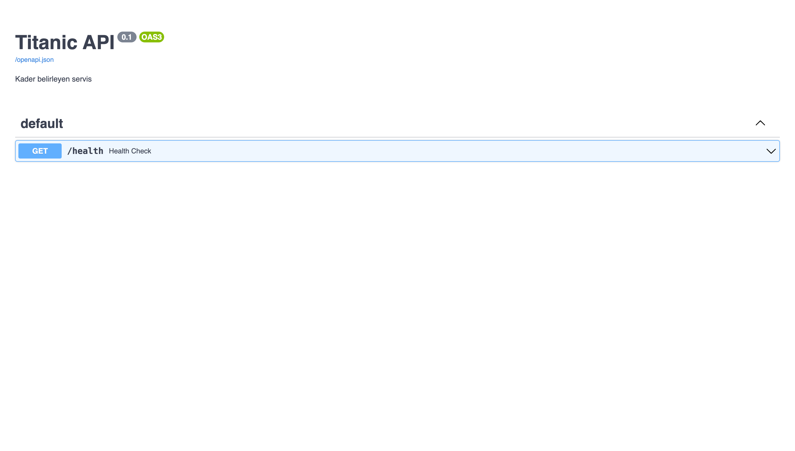

# GSÜ Example
# Açıklama

Bu çalışma kapsamında temel bir streamlit uygulamasını front-end, fastapi uygulamasını back-end, aradaki istekler içinde kafka yapısını kullanacağız. Kullanıcıdan streamlit üzerinden değerleri alarak kafka'da to_process adlı topic'e yollayıp, arka plandaki fastapi servisimizle bu değerleri topic'ten alacak, tahminleme işlemini gerçekleştireceğiz. Ardından API'den işlenmiş verinin sonucunu processed topic'ine yazacağız. Consumer adını verdiğimiz python kodumuzda bu değerleri alıp bir json dosyasına yazacak. Streamlit uygulamamızda json'daki değerleri sürekli okuyarak kullanıcıya sonucu dönecek. 

Kafka üzerindeki topicleri, producer ve consumer'ları da kafkaui adını verdiğimiz uygulama üzerinden takip edebileceğiz. 

Not: Bu sistem bu tip bir uygulama için en iyi mimariyi içermez, öğrencilere bu teknolojilerin anlatılması için geliştirilmiştir. 

Uygulamanın çalışması şeması;


# AWS üzerinde Canlıya Alma
- AWS üzerinde uygulamanın canlıya alınabilmesi için öncelikle [AWS EC2](https://us-east-1.console.aws.amazon.com/ec2/) servisi üzerinden 1GB RAM 1VCPU'ya sahip bir makine açılması gerekmektedir. Makine tipi olarak ücretsiz olduğu için t2.micro tercih edilebilir. 
- Ayarlar yapılırken security group ayarında bütün portlar(önerilmez veya streamlit uygulamasının yayınlanacağı porta erişim verilmesi gerekmektedir. 
- Makine açıldıktan sonra makineye ssh veya ec2-serial-console kullanılarak erişilebilir.
- Amazon makineleri yüksek ihtimalle python3 yüklü olarak gelmektedir. Eğer gelmediyse internet üzerinden Debian/Linux makinelere nasıl python yükleneceğine bakabilirsiniz.
- Makineye gerekli kodların çekilebilmesi için git yüklenir. 


### Gerekli Kütüphanelerin Yüklenmesi
```
# Sudo yetkisi alınmadıysa sudo su ile yetki alınmalıdır. 
yum install docker git -y

# Docker servisinin başlatılması
systemctl restart docker
```

### Docker Compose Yükleme
Docker compose yüklemek için alttaki komutları kullanabilirsiniz.
```
sudo curl -L https://github.com/docker/compose/releases/latest/download/docker-compose-$(uname -s)-$(uname -m) -o /usr/local/bin/docker-compose

sudo chmod +x /usr/local/bin/docker-compose

docker-compose version
```

### Çalıştırma
İlk çalıştırma için --build komutunu kullanarak imagelerin kurulmasını sağlıyoruz. 
```
docker-compose up --build
```

Ardından makinenin public ipsinde 8501 portuna giderek uygulamaya erişebilirsiniz. 8080 Portundan KafkaUI adlı uygulama yardımıyla kafka bilgilerine erişebilirsiniz.

Uygulama Görselleri

- KafkaUI
  - 
- Streamlit
  -  
- FastAPI
  - 
